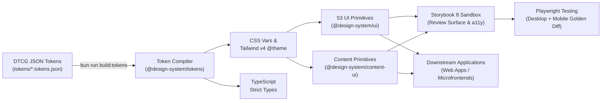

# AI-Native Design System Template

> **Production-ready, AI-native design system template with code as the single source of truth to unify autonomous and human UI/UX engineering.**  
> Powered by W3C DTCG tokens, Tailwind CSS v4, 53 shadcn/ui primitives, Google Stitch `DESIGN.md`, Storybook 8, Playwright visual regression, Bun, and Turborepo.

[-blue)](https://github.com/Victory-7291/design-system-template)
[](https://turbo.build)
[](https://bun.sh)
[](https://tailwindcss.com)
[](https://www.typescriptlang.org)
[](https://ui.shadcn.com)
[](https://storybook.js.org)
[](https://playwright.dev)
[](https://stitch.withgoogle.com)

---

## 1. Problem Statement: What Does This Project Solve?

In the era of AI-accelerated software development (Cursor, Codex, Claude Code, Antigravity, Copilot), the traditional handoff from design mockups to hand-written CSS breaks down across three critical chasms:

| Failure Mode | Root Cause | How This System Solves It |
| :--- | :--- | :--- |
| **AI Visual Drift & "AI Slop"** | AI models lack machine-readable constraints, hallucinating arbitrary hex codes, nested cards, and uncalibrated gradients. | **Plain-Text Design Contract (`DESIGN.md`)**: Provides an authoritative, token-efficient specification injected directly into AI system prompts, bounding generation within strict design rules. |
| **Multi-Repo CSS Divergence** | Multiple products and micro-frontends duplicate and diverge their styling over time. | **Single Authoritative Token Pipeline**: W3C DTCG design tokens compile into versioned packages (`@design-system/tokens`, `@design-system/ui`) providing a single source of truth across all applications. |
| **Silent Accessibility & Visual Regressions** | Contrast failures and broken responsive layouts slip into production due to manual inspection limits. | **Automated Machine Gates**: `@google/design.md` CLI enforces mathematical WCAG 2.1 AA contrast verification, Storybook audits accessibility via axe-core, and Playwright executes dual-viewport pixel diffing. |

---

## 2. Technology Stack

- **Design Token Standard**: [W3C DTCG Format Specification](https://designtokens.org) for platform-neutral token definitions.
- **Styling Engine**: [Tailwind CSS v4](https://tailwindcss.com) utilizing native `@theme` variables and modern CSS Color 4 standards.
- **UI Primitives**: Complete suite of **53 [shadcn/ui](https://ui.shadcn.com) components** built on [Radix UI](https://www.radix-ui.com) unstyled primitives with full keyboard navigation and focus management.
- **Plain-Text Design System**: Google Stitch [DESIGN.md](DESIGN.md) specification verified by the official [`@google/design.md`](https://stitch.withgoogle.com/docs/design-md/overview/) CLI.
- **Type Safety**: [TypeScript 5+](https://www.typescriptlang.org) in strict mode with full prop type exports.
- **Package Manager & Orchestration**: [Bun](https://bun.sh) 1.3+ workspaces managed by [Turborepo](https://turbo.build) 2.x for topological builds and caching.
- **Visual Sandbox & a11y**: [Storybook 8](https://storybook.js.org) with `@storybook/addon-a11y` (axe-core) for 1-to-1 story state coverage.
- **Visual Regression Testing**: [Playwright](https://playwright.dev) dual-viewport (Desktop 1280x800 & Mobile 390x844) automated snapshot comparison.

---

## 3. The Unidirectional Design Pipeline

The repository enforces a single authoritative, unidirectional build flow from raw design tokens to production applications:



1. **Token Compilation**: `bun run build:tokens` resolves aliases and compiles DTCG JSON into CSS variables, Tailwind v4 `@theme` bindings, TypeScript types, and reduced-motion safety fallbacks.
2. **Specification Linting**: `bun run lint:design` uses the `@google/design.md` CLI to mathematically verify WCAG AA contrast (≥ 4.5:1) across all component definitions.
3. **Automated Verification**: `bun run typecheck`, `bun run build`, and `bun run test:visual` ensure zero type regressions and 100% pixel-perfect stability before merging.

---

## 4. Repository Architecture & Directory Structure

```text
design-system-template/
├── tokens/                         # W3C DTCG Standard Design Tokens (JSON)
│   ├── foundation.tokens.json      # Base tokens: colors, 4px spacing scale, radius, fonts, motion
│   └── semantic.tokens.json        # Semantic aliases: surface elevation, text, border, action, status
├── packages/
│   ├── design-tokens/              # [Token Compiler] DTCG JSON -> CSS / Tailwind v4 / TS
│   │   ├── src/build.ts            # Recursive alias resolver, light/dark themes, @theme generator
│   │   └── dist/                   # Emitted artifacts: tokens.css, index.js, index.d.ts
│   ├── ui/                         # [Core UI Library] (@design-system/ui - 53 shadcn/ui Primitives)
│   │   ├── components.json         # shadcn/ui CLI configuration
│   │   ├── src/
│   │   │   ├── components/ui/      # 53 shadcn primitives (Button, Dialog, Sheet, Tabs, Chart...)
│   │   │   ├── components/         # ModeToggle (theme switcher)
│   │   │   ├── hooks/              # use-mobile.ts (responsive breakpoint hook)
│   │   │   ├── providers/          # theme.tsx (NextThemesProvider wrapper)
│   │   │   ├── lib/                # utils.ts (cn), fonts.ts (pure CSS variable font mapping)
│   │   │   ├── text.tsx            # Typography primitives (display, h1~h3, body)
│   │   │   └── surface.tsx         # Semantic card and container primitives
│   │   └── dist/                   # Compiled ES modules and TypeScript definitions
│   └── content-ui/                 # [Editorial Content Library] (@design-system/content-ui)
│       └── src/                    # ArticleShell (max-w-[68ch]), Callout, Prose
├── apps/
│   └── storybook/                  # [Visual Sandbox & a11y] Storybook 8 + Vite 6
│       └── src/stories/            # 1-to-1 mapped stories for all 53 UI primitives + content
├── tests/
│   └── visual/                     # [Playwright Visual Regression Suite]
│       ├── __snapshots__/          # Desktop Chrome (1280x800) & Mobile Chrome (390x844) baselines
│       └── components.spec.ts      # Automated visual regression comparison specs
├── scripts/                        # Automation & Harness Utilities
│   └── serve-storybook.ts          # Local static Storybook server for Playwright runner
├── docs/                           # Architectural & Engineering Guides
│   ├── Design-System-Specifications.md # Complete specifications & science rationale
│   ├── Google-Design-CLI-Guide.md      # @google/design.md CLI integration & CI gates
│   ├── Design-System-Build-Guide.md    # Architecture, pipeline, and test harness guide
│   └── Design-System-Usage-Guide.md    # Downstream application consumption guide
├── DESIGN.md                       # Google Stitch plain-text design system (AI & CLI verified)
├── AGENTS.md                       # Binding AI agent UI contract and governance rules
├── turbo.json                      # Turborepo task pipeline configuration
└── package.json                    # Workspace root configuration (Bun workspaces)
```

---

## 5. Documentation Index

Detailed architectural rationale and usage instructions are maintained across dedicated guides:

- [**DESIGN.md**](DESIGN.md): The official Google Stitch plain-text design system specification used by AI agents and verified by CLI tooling.
- [**AGENTS.md**](AGENTS.md): Binding UI contract and operational rules for AI coding assistants and developers.
- [**Design System Specifications**](docs/Design-System-Specifications.md): Comprehensive specifications covering W3C DTCG standards, OKLCH wide-gamut modeling, WCAG 2.1 AA / APCA contrast constraints, 5-tier surface elevation, micro-motion, and the 3-step promotion pipeline.
- [**Google Design CLI Guide**](docs/Google-Design-CLI-Guide.md): In-depth guide for `@google/design.md` CLI commands (`lint`, `diff`, `export`, `spec`) and CI/CD PR regression gates.
- [**Design System Build Guide**](docs/Design-System-Build-Guide.md): Monorepo build architecture, component placement criteria, `test-results/` runtime explanation, and `serve-storybook.ts` test harness setup.
- [**Downstream Usage Guide**](docs/Design-System-Usage-Guide.md): Quickstart guide for installing and importing design tokens and UI primitives in downstream web applications.

---

## 6. Quickstart & CLI Reference

Run commands from the repository root:

```bash
# 1. Install workspace dependencies
bun install

# 2. Compile DTCG design tokens to CSS and TypeScript definitions
bun run build:tokens

# 3. Lint DESIGN.md specification and verify WCAG contrast ratios
bun run lint:design

# 4. Run workspace-wide TypeScript type checking
bun run typecheck

# 5. Build all packages and applications via Turborepo
bun run build

# 6. Launch the interactive Storybook sandbox (http://localhost:6006)
bun run storybook

# 7. Execute Playwright dual-viewport visual regression tests
bun run test:visual

# 8. Update visual golden baseline snapshots after verified design updates
bun run test:visual:update
```

---

## License

MIT License. Engineered for modern AI-native development teams.
