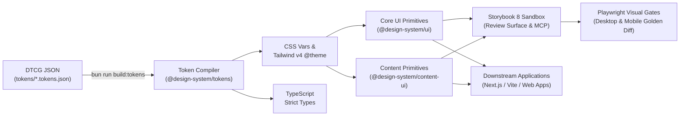
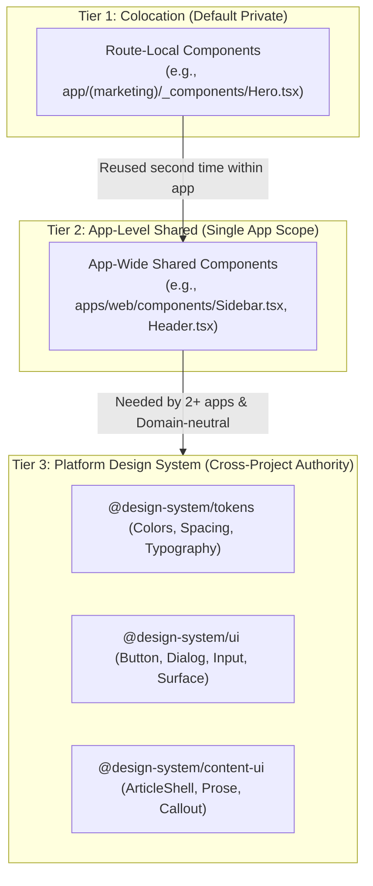

# AI-Native Design System Template

> **A production-grade, Code-as-Design infrastructure for modern software engineering teams and autonomous AI coding agents.**
> Designed to unify brand aesthetics, eliminate AI hallucinations, and enforce mathematical and visual consistency across all web products, applications, and content surfaces.

[-blue)](https://github.com/Victory-7291/design-system-template)
[](https://turbo.build)
[](https://bun.sh)
[](https://tailwindcss.com)
[](https://www.typescriptlang.org)
[](https://ui.shadcn.com)
[](https://storybook.js.org)
[](https://playwright.dev)

---

## 👨‍💻 Author & Architecture Attribution

**Created & Architected by:**
**Vic** — Co-founder & CTO at Phanvic Inc.

---

## Table of Contents

1. [Core Philosophy: Code-as-Design & AI-Native Governance](#1-core-philosophy-code-as-design--ai-native-governance)
2. [Deep Architectural Decisions](#2-deep-architectural-decisions)
   - [Why Split into Multiple Packages?](#why-split-into-multiple-packages)
   - [Why Tokens Alone Fail: The Necessity of Components](#why-tokens-alone-fail-the-necessity-of-components)
3. [3-Tier Component Encapsulation Model](#3-3-tier-component-encapsulation-model)
   - [Placement Decision Matrix](#placement-decision-matrix)
   - [Where to Maintain Complex Page Compositions & Mockups](#where-to-maintain-complex-page-compositions--mockups)
4. [Repository & Directory Architecture](#4-repository--directory-architecture)
5. [Technology Stack Standards](#5-technology-stack-standards)
6. [Downstream Application Integration Guide](#6-downstream-application-integration-guide)
   - [Package Installation](#1-package-installation)
   - [Global CSS & Tailwind v4 Integration](#2-global-css--tailwind-v4-integration)
   - [Root Layout & ThemeProvider Setup](#3-root-layout--themeprovider-setup)
   - [Consuming UI Primitives](#4-consuming-ui-primitives)
   - [Editorial & Content Rendering](#5-editorial--content-rendering)
7. [The AI Coding Agent UI Contract](#7-the-ai-coding-agent-ui-contract)
   - [Binding Rules](#binding-rules-for-ai-agents)
   - [Anti-Patterns & Banned Behaviors](#anti-patterns-checklist)
8. [Extending shadcn/ui Primitives](#8-extending-shadcnui-primitives)
9. [CLI & Workflow Reference](#9-cli--workflow-reference)
10. [Future Multi-App Roadmap (`apps/`)](#10-future-multi-app-roadmap-apps)
11. [License](#license)

---

## 1. Core Philosophy: Code-as-Design & AI-Native Governance

In an era where software development is heavily augmented by AI agents (Cursor, Codex, Claude Code, Antigravity, etc.), traditional "Figma mockups to hand-written CSS" workflows break down across three critical chasms:

| Traditional Breakdown | Target Mechanism | Verifiable Outcome |
| :--- | :--- | :--- |
| **AI Aesthetic Fatigue & Hallucinations** | Machine-readable tokens, typed primitives, golden stories, and agent contracts | AI models compose exclusively within authoritative catalogs instead of inventing ad-hoc UI |
| **Multi-Repo CSS Divergence** | Single versioned design system package consumed across all applications | Every design token or primitive change has an audit trail, version number, and rollback point |
| **Visual Regression by Human Guesswork** | Isolated component rendering + dual-viewport golden screenshots in CI | Every pull request pinpoints exact pixel-level diffs and broken states automatically |

### The Unidirectional Flow Pipeline



> **The Sovereign Rule**: **Code, versioned tokens, and component APIs are the sole source of visual truth. Storybook provides the human aesthetic review surface; Playwright visual regression acts as the automated CI gatekeeper; AI agents compose strictly within the authoritative catalog.**

---

## 2. Deep Architectural Decisions

### Why Split into Multiple Packages?

Many starter repositories combine tokens, components, and utilities into a single monolithic package. This template enforces a clean separation into `@design-system/tokens`, `@design-system/ui`, and `@design-system/content-ui` based on three fundamental software engineering principles:

#### 1. Zero-Dependency Token Distribution
- **`@design-system/tokens` is 100% static styling assets** (CSS custom properties, Tailwind v4 `@theme`, and TypeScript constants). Its runtime dependency footprint is **zero**.
- When generating static HTML landing pages, transactional email templates, or non-React micro-frontends, you can import `@design-system/tokens/css` directly.
- Consuming applications avoid bundling megabytes of unnecessary dependencies like React 19, Radix UI, or animation engines just to access brand colors and typography scales.

#### 2. Lifecycle & Release Frequency Isolation
- **`@design-system/ui` (Core Primitives)**: Highly stable. Once an accessible `Button`, `Dialog`, or `Input` is verified, its API rarely changes.
- **`@design-system/content-ui` (Editorial & Marketing Blocks)**: Rapid iteration. Content teams frequently introduce new editorial elements (e.g., `Callout`, `Figure`, `TweetCard`, `NewsletterCTA`).
- **Decoupling Benefit**: Updating an editorial callout component only releases `@design-system/content-ui`, never risking breaking core application dashboards or triggering unnecessary full-workspace builds.

#### 3. Prevention of the "Monolithic Garbage Drawer" Anti-Pattern
- Lumping all shared code into a generic package creates an unmaintainable grab-bag where components accumulate undocumented boolean props and zombie code. Small, purposeful packages enforce clean boundary checks.

---

### Why Tokens Alone Fail: The Necessity of Components

> **Warning**: A design system that maintains only tokens without components will inevitably lead to aesthetic chaos in an AI-driven codebase.

Relying solely on CSS variables and expecting applications to hand-roll their own HTML elements produces three critical failures:

1. **Accessibility (a11y) & Tactile Quality Cannot Live in Tokens**:
   - A compliant button requires focus-visible ring styles, `:active:scale-[0.98]` tactile spring physics, loading state `aria-busy` indicators, and click-duplication prevention.
   - A modal dialog requires `Esc` key dismissal, focus trap management, outside-click detection, and mobile viewport scroll-locking. Tokens cannot enforce these behaviors.
2. **AI Agents Hallucinate Without Component Bounds**:
   - Given raw Tailwind classes and CSS variables, an LLM will assemble arbitrary combinations on every page (e.g., mismatched padding, competing drop shadows, inconsistent rounded corners).
   - Typed components (`<Button variant="default" size="default">`) constrain the agent's generative surface to validated, accessible combinations.
3. **Loss of Global Visual Propagation**:
   - With shared components, updating brand corner radiuses or active states requires modifying a single component file to update hundreds of instances across all apps simultaneously.
   - Without components, developers and AI agents must execute error-prone global search-and-replace operations across disparate Tailwind classes.

---

## 3. 3-Tier Component Encapsulation Model

To maintain a lean design system, follow the principle of **"Default Private, Sharing is an Explicit Decision"**:



### Placement Decision Matrix

| Component Category | Typical Examples | Target Location | Rationale |
| :--- | :--- | :--- | :--- |
| **Core Primitives** | `Button`, `Input`, `Dialog`, `Text`, `Surface`, `Badge` | **`@design-system/ui`** | Zero business logic, domain-neutral, universally reused. |
| **Editorial Blocks** | `ArticleShell`, `Callout`, `Prose`, `CodeBlock` | **`@design-system/content-ui`** | Specialized for Markdown/MDX content and documentation rendering. |
| **App Shells** | `AppSidebar`, `MainNavbar`, `GlobalFooter` | **`apps/web/components/`** | Tightly coupled to the application's specific routes, auth state, and navigation structure. |
| **Page Compositions** | `HomeHeroSection`, `PricingTable`, `FeatureBento` | **Colocation (`app/.../_components/`)** | Domain-heavy, single-page use, fast-evolving layout experiments. |

### Where to Maintain Complex Page Compositions & Mockups

Complex page sections (e.g., animated hero headers, multi-tier pricing calculators, bento grids) should **not** be forced into rigid React components in `@design-system/ui` with dozens of props.

**The Golden Industry Pattern (Storybook Templates & Recipes)**:
1. **Source Code Lives Locally**: Keep the composition code in the application's route directory, assembled from atomic primitives (`Button`, `Text`, `Surface`).
2. **Golden Patterns Documented in Storybook**:
   - Maintain canonical templates in `apps/storybook/src/stories/templates/` (e.g., `HeroSection.stories.tsx`, `PricingGrid.stories.tsx`).
   - **Reviewers**: Inspect and approve the layout and responsive behavior in Storybook.
   - **AI Coding Agents**: Query the Storybook MCP server or inspect template stories as in-context examples, generating pixel-perfect compositions in application routes without bloating the component library.

---

## 4. Repository & Directory Architecture

```text
design-system-template/
├── tokens/                         # W3C DTCG Standard Design Tokens (JSON)
│   ├── foundation.tokens.json      # Base tokens: colors, 4px spacing scale, radius, fonts
│   └── semantic.tokens.json        # Semantic aliases: surface, text, border, action
├── packages/
│   ├── design-tokens/              # [Token Compiler] DTCG JSON -> CSS / Tailwind v4 / TS
│   │   ├── src/build.ts            # Recursive alias resolver, light/dark themes, @theme generator
│   │   └── dist/                   # Emitted artifacts: tokens.css, index.js, index.d.ts
│   ├── ui/                         # [Core UI Library] (@design-system/ui)
│   │   ├── components.json         # shadcn/ui CLI configuration
│   │   ├── src/
│   │   │   ├── components/ui/      # Latest shadcn primitives (Button, Dialog, Sheet, Tabs...)
│   │   │   ├── components/         # ModeToggle (light/dark theme toggle dropdown)
│   │   │   ├── hooks/              # use-mobile.ts (responsive breakpoint detection)
│   │   │   ├── providers/          # theme.tsx (NextThemesProvider wrapper)
│   │   │   ├── lib/                # utils.ts (cn), fonts.ts (pure CSS variable font mapping)
│   │   │   ├── text.tsx            # Typography primitive (display, h1~h3, body max-65ch)
│   │   │   └── surface.tsx         # Semantic card and background container
│   │   └── dist/                   # Compiled ES modules and TypeScript definitions
│   └── content-ui/                 # [Editorial Content Library] (@design-system/content-ui)
│       └── src/                    # ArticleShell (max-w-[68ch]), Callout, Prose
├── apps/
│   ├── storybook/                  # [Visual Review & AI Sandbox] Storybook 8 + Vite 6
│   │   └── src/stories/            # State-coverage stories for all primitives and templates
│   ├── docs/                       # [Planned] Official design guideline portal (Fumadocs/Nextra)
│   └── playground/                 # [Planned] Interactive browser-based layout workbench
├── tests/
│   └── visual/                     # [Playwright Visual Regression Suite]
│       ├── __snapshots__/          # Desktop Chrome (1280x800) & Mobile Chrome (390x844) baselines
│       └── components.spec.ts      # Automated screenshot comparison specs
├── AGENTS.md                       # Binding AI agent UI contract and governance rules
├── turbo.json                      # Turborepo task pipeline configuration
└── package.json                    # Workspace root configuration (Bun workspaces)
```

---

## 5. Technology Stack Standards

- **Runtime & Package Manager**: [Bun](https://bun.sh) 1.3+ for ultra-fast dependency resolution and native TypeScript script execution.
- **Task Orchestration**: [Turborepo](https://turbo.build) 2.x for topological dependency ordering (`dependsOn: ["^build"]`) and local/remote build caching.
- **Styling Engine**: [Tailwind CSS v4](https://tailwindcss.com) utilizing native `@theme` directives without legacy PostCSS baggage.
- **Type System**: [TypeScript 5+](https://www.typescriptlang.org) in strict mode across all workspaces.
- **Accessible Primitives**: [shadcn/ui](https://ui.shadcn.com) built atop [Radix UI](https://www.radix-ui.com) unstyled primitives.
- **Visual Sandbox**: [Storybook 8](https://storybook.js.org) with `@storybook/react-vite` and `@storybook/addon-a11y`.
- **Regression Gates**: [Playwright](https://playwright.dev) testing visual snapshots across both desktop and mobile viewports.
- **Font Policy**: Decoupled from framework-specific runtimes (no hard dependency on `next/font`). Font variables `--font-sans` and `--font-mono` are declared by `@design-system/tokens`.

---

## 6. Downstream Application Integration Guide

### 1. Package Installation
In your downstream application (Next.js, Vite, Remix, etc.), declare workspace dependencies:

```json
{
  "dependencies": {
    "@design-system/tokens": "workspace:*",
    "@design-system/ui": "workspace:*",
    "@design-system/content-ui": "workspace:*"
  }
}
```

### 2. Global CSS & Tailwind v4 Integration
In your application's global CSS entry point (`app/globals.css` or `src/styles.css`):

```css
/* 1. Import design system tokens & Tailwind v4 @theme rules */
@import "@design-system/tokens/css";

/* 2. Import Tailwind v4 base utilities */
@import "tailwindcss";

/* 3. Base layout defaults */
body {
  background-color: var(--color-surface-canvas);
  color: var(--color-text-primary);
  font-family: var(--font-sans);
  min-height: 100dvh;
}
```

### 3. Root Layout & ThemeProvider Setup
Wrap your root layout using the design system's `ThemeProvider` to support light/dark modes without hydration mismatch:

```tsx
// app/layout.tsx
import "@design-system/tokens/css";
import "./globals.css";
import { ThemeProvider, ModeToggle } from "@design-system/ui";

export default function RootLayout({ children }: { children: React.ReactNode }) {
  return (
    <html lang="en" suppressHydrationWarning>
      <body className="antialiased min-h-[100dvh] flex flex-col">
        <ThemeProvider>
          <header className="px-6 py-4 border-b border-[var(--color-border-default)] flex justify-between items-center">
            <span className="font-bold tracking-tight">Application</span>
            <ModeToggle />
          </header>
          <main className="flex-1">{children}</main>
        </ThemeProvider>
      </body>
    </html>
  );
}
```

### 4. Consuming UI Primitives
```tsx
import { Button, Dialog, DialogTrigger, DialogContent, Input, Text, Surface } from "@design-system/ui";

export function SettingsSection() {
  return (
    <Surface variant="raised" className="max-w-md mx-auto space-y-4">
      <Text variant="h2">Account Settings</Text>
      <Text variant="body">Manage your profile and communication preferences.</Text>

      <div className="space-y-2">
        <label className="text-sm font-medium text-[var(--color-text-secondary)]">Username</label>
        <Input placeholder="Enter username" />
      </div>

      <Dialog>
        <DialogTrigger asChild>
          <Button variant="default">Save Changes</Button>
        </DialogTrigger>
        <DialogContent>
          <Text variant="h3">Confirm Updates</Text>
          <Text variant="body">Are you sure you want to commit these changes?</Text>
        </DialogContent>
      </Dialog>
    </Surface>
  );
}
```

### 5. Editorial & Content Rendering
For blog posts, articles, and documentation generated by content engines, use `@design-system/content-ui`:

```tsx
import { ArticleShell, Prose, Callout } from "@design-system/content-ui";

export default function DocumentationPage() {
  return (
    <ArticleShell
      title="Engineering an AI-Native Architecture"
      subtitle="How code-as-design and automated visual testing eliminate quality decay."
      category="Architecture"
      author="Engineering Team"
      publishedAt="2026-09-13"
    >
      <Prose>
        <p>AI-assisted coding requires strict architectural boundaries to prevent style divergence.</p>
        <Callout variant="tip" title="Best Practice">
          Never hardcode hex values. Always consume semantic tokens.
        </Callout>
      </Prose>
    </ArticleShell>
  );
}
```

---

## 7. The AI Coding Agent UI Contract

All AI Coding Agents generating or modifying UI across the codebase must adhere to these five binding rules:

### Binding Rules for AI Agents
1. **Query Before Generating**: Always query the Storybook catalog or inspect `@design-system/ui` exports before writing UI components. Never hallucinate non-existent props or variants.
2. **Mandatory State Coverage**: When introducing or modifying components, corresponding Storybook stories must be provided covering: `default`, `hover/active`, `focus`, `loading`, `disabled`, `empty`, `error`, `long-content`, and `mobile`.
3. **Token Authority**: Never write raw hex/rgb codes, inline box-shadows, or uncalibrated animations in business code.
4. **Composition Over Proliferation**: Prefer assembling existing primitives. Do not create one-off components in the shared library for single-page layouts.
5. **All Gates Must Pass**: Verify changes with `bun run typecheck`, `bun run build`, and `bun run test:visual`.

### Anti-Patterns Checklist

| Banned Pattern | Incorrect (Don't) | Correct (Do) |
| :--- | :--- | :--- |
| **Hardcoding Raw Hex Values** | `<div className="bg-[#09090b] text-[#fafafa]">` | `<div className="bg-[var(--color-surface-canvas)] text-[var(--color-text-primary)]">` or `<Surface>` |
| **AI Hallucinated Props** | `<Button color="purple" isAwesome={true}>` | Consult `@design-system/ui` exported props and variants |
| **Multiple Primary CTAs** | Two equal primary buttons in the same viewport | Exactly one primary action; use secondary/outline for others |
| **Custom Uncalibrated Shadows** | `shadow-[0_10px_30px_rgba(120,50,255,0.3)]` | Use standard elevation variables from `@design-system/tokens` |
| **Overriding a11y Focus Rings** | `outline-none focus:outline-none` | Preserve `focus-visible:ring-2` accessible focus states |

---

## 8. Extending shadcn/ui Primitives

To add additional primitives from the shadcn registry into `@design-system/ui`:

```bash
# 1. Navigate to the UI package
cd packages/ui

# 2. Add the component using the CLI (e.g., accordion)
bunx shadcn@latest add accordion --yes

# 3. Export the newly added primitive in packages/ui/src/index.ts
# export * from "./components/ui/accordion.js";

# 4. Add a Storybook story in apps/storybook/src/stories/Accordion.stories.tsx

# 5. Verify the build and update visual snapshots
bun run build
bun run test:visual:update
```

---

## 9. CLI & Workflow Reference

Run commands from the repository root:

```bash
# Compile DTCG JSON tokens to CSS variables and TypeScript definitions
bun run build:tokens

# Run workspace-wide TypeScript type checking
bun run typecheck

# Build all packages and applications via Turborepo
bun run build

# Launch the interactive Storybook sandbox (http://localhost:6006)
bun run storybook

# Build the static Storybook production site
bun run storybook:build

# Execute Playwright dual-viewport visual regression tests
bun run test:visual

# Update visual golden baseline snapshots after verified design updates
bun run test:visual:update
```

---

## 10. Future Multi-App Roadmap (`apps/`)

The repository leverages an `apps/` directory to facilitate future modular expansion:
1. **`apps/storybook`**: The active component sandbox and Playwright test harness for engineers and AI agents.
2. **`apps/docs`**: A planned documentation portal (built on Fumadocs or Nextra) for designers, product managers, and non-technical stakeholders to explore design principles, brand voice, and token references.
3. **`apps/playground`**: An upcoming interactive canvas for assembling and testing full-page templates in real time.

---

## License

MIT License. Designed and architected with precision for modern AI-native engineering teams.
