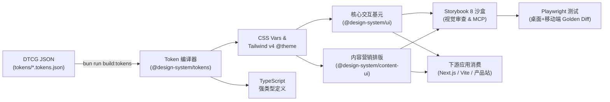
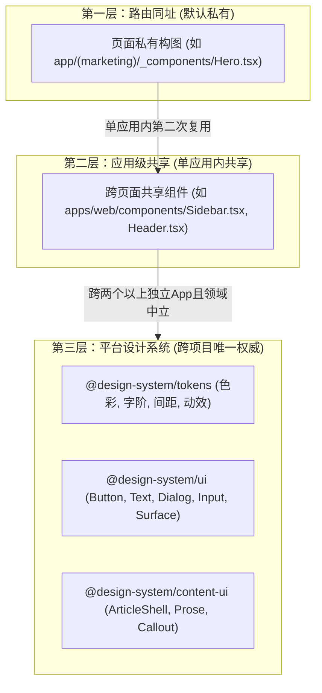

# AI-Native Design System Template

> **A production-grade, Code-as-Design infrastructure for modern software engineering teams and autonomous AI coding agents.**
> Designed to unify brand aesthetics, eliminate AI hallucinations, and enforce mathematical and visual consistency across all web products, applications, and content surfaces.

[-blue)](https://github.com)
[](https://turbo.build)
[](https://bun.sh)
[](https://tailwindcss.com)
[](https://www.typescriptlang.org)
[](https://ui.shadcn.com)
[](https://storybook.js.org)
[](https://playwright.dev)

---

## 👨‍💻 Author & Architecture Attribution

**Created & Maintained by:**
**Vic** — Co-founder & CTO at Phanvic Inc.

---

## 一、 核心架构哲学：Code-as-Design 与 AI-Native 治理

在全面以 AI（Cursor, Codex, Claude Code, Antigravity 等）辅助编码的技术团队中，传统的“Figma 设计稿切图交付”模式面临三大断层：

| 传统痛点 | 目标机制 | 可验证结果 |
| :--- | :--- | :--- |
| **AI 审美疲劳与自由漂移** | 命名 Token、受限组件、范例故事与强类型合同 | AI 只能在权威组件目录与白名单 API 内组合，不得自由发明 UI |
| **样式多头割裂** | 官网、产品、内容站各自维护 `globals.css` | 单一版本化设计系统包，所有下游应用显式依赖并拥有回滚点 |
| **写完代码肉眼排查** | 组件隔离渲染、双分辨率 Golden Snapshot 门禁 | 每次改动自动化高亮“哪个像素 / 哪个状态变了” |

### 单向权威流通管线 (The Unidirectional Pipeline)



> **核心法则**：**代码、版本化 Token 和组件 API 是唯一的视觉真理源；Storybook 是人工审美审查面；Playwright 视觉回归是防倒退门禁；AI 只能在权威组件目录内组装。**

---

## 二、 架构深度剖析 (Deep Architectural Decisions)

### 1. 为什么拆分为多个 Packages，而不是一个单一的大杂烩包？

很多初创模版习惯把所有组件、Token、Hook 塞进一个庞大的 `packages/design-system` 或 `packages/common`。本模版坚持将它们拆分为 `@design-system/tokens`、`@design-system/ui`、`@design-system/content-ui`，原因在于三大工程原则：

1. **运行时依赖彻底隔离 (Zero-Dependency Tokens)**：
   - `@design-system/tokens` 是纯静态样式资产（仅包含 CSS 变量、Tailwind v4 `@theme` 和 TypeScript 常量），**运行时依赖为 0**。
   - 当你需要编写原生 HTML 落地页、EDM 营销邮件模板或微前端页面时，只需引入 `@design-system/tokens/css`，完全无需安装 `React 19`、`Radix UI` 等体积庞大的依赖。
2. **发布生命周期与变更频率隔离**：
   - `@design-system/ui`（Button, Dialog, Input）高度稳定，极少变动；
   - `@design-system/content-ui`（ArticleShell, Callout, Prose）敏捷迭代，高频配合社媒内容发布。
   - 拆分后，修改文章排版模块时，绝不影响核心业务后台的构建与稳定性。
3. **杜绝“分布式单体与垃圾抽屉”**：
   - 专一的包职责让每个依赖清晰可追溯，杜绝代码无人敢删、参数无限膨胀的顽疾。

---

### 2. 灵魂拷问：Design System 必须维护组件吗？只维护 Tokens 够不够？

> **结论：如果 Design System 只维护 Tokens，对于以 AI 编码为主的团队，整套系统不出两周必将彻底崩溃。**

1. **无法约束可访问性 (a11y) 与复杂交互手感**：
   - 一个符合标准的按钮需要键盘 `focus-visible` 焦点环、`:active:scale-[0.98]` 微物理反馈、加载态 `aria-busy` 与防重复点击；
   - 弹窗与下拉框涉及 `Esc` 关闭、焦点陷阱（Focus Trap）、点击外部关闭与移动端触摸滚动穿透防护。
   - 只给 Tokens，各应用各自手写实现，必然导致交互手感割裂、Bug 丛生。
2. **AI 编码的致命灾难：失去边界与审美漂移**：
   - **AI 是无法仅靠 Tokens 保持自律的**。只提供颜色变量，AI 在每个页面都会自由拼装类名（一会儿加无名渐变，一会儿内边距失衡）。
   - **强类型组件是 AI 的防盗门**：只有把交互封装为 `<Button variant="default" size="default">`，AI 的生成空间才会被收窄在受控 API 之中。
3. **视觉迭代无法全局传播**：
   - 集中维护组件，品牌微调（如调整圆角或焦点环阴影）只需改动一行代码，全公司成百上千个页面瞬间完成无缝升级。

---

## 三、 组件封装三层模型与归属判据 (3-Tier Encapsulation Model)

为了防止组件库膨胀为“万能组件垃圾场”，严格执行 **“默认私有，共享是显式决策”**：



### 1. 组件归属判据表 (Placement Decision Matrix)

| 组件类别 | 典型示例 | 存放位置 | 判定理由 |
| :--- | :--- | :--- | :--- |
| **纯基础基元 (Primitives)** | `Button`, `Input`, `Dialog`, `Text`, `Surface`, `Badge` | **`@design-system/ui` (设计系统)** | 零业务逻辑、领域中立、跨所有项目高频复用。 |
| **内容排版块 (Editorial Blocks)** | `ArticleShell`, `Callout`, `Prose`, `CodeBlock` | **`@design-system/content-ui` (设计系统)** | 专用于 Markdown / 营销长文内容渲染。 |
| **应用级外壳 (App Shells)** | `AppSidebar`, `MainNavbar`, `GlobalFooter` | **`apps/web/components/` (业务应用内)** | 深度绑定了当前应用的路由结构、用户状态与导航配置。 |
| **页面具体构图 (Compositions)** | `HomeHeroSection`, `PricingTable`, `FeatureBento` | **路由同址 (如 `app/.../_components/`)** | 强业务相关、单页专用、变动极快，严禁过早下沉。 |

### 2. 复杂“设计稿 / 页面构图”维护法则 (Storybook Templates)
- **源码留在业务应用中**：具体页面的构图直接用原子基元（`Button`, `Text`, `Surface`）在业务仓库中就近组装。
- **黄金范例收录在 Storybook 的 `Templates/` 目录**：
  - 在 `apps/storybook/src/stories/templates/` 中维护诸如 `HeroSection.stories.tsx`、`PricingGrid.stories.tsx`。
  - **设计师与审查者**：通过 Storybook 直观审视经过批准的构图标杆；
  - **AI Coding Agent**：通过 Storybook MCP 读取黄金范例故事作为参考上下文（Context），直接在业务仓库中组装输出，既保证了顶级审美，又保持了设计系统包的纯净。

---

## 四、 仓库目录架构规范 (Repository Structure)

```text
design-system-template/
├── tokens/                         # W3C DTCG 标准设计变量源 (JSON)
│   ├── foundation.tokens.json      # 底层变量：色相、间距(4px节奏)、圆角、字体
│   └── semantic.tokens.json        # 语义映射：surface, text, border, action
├── packages/
│   ├── design-tokens/              # 【Token 编译器】DTCG -> CSS / Tailwind v4 / TS
│   │   ├── src/build.ts            # 递归解析别名引用，生成深浅色变量与 @theme
│   │   └── dist/                   # 输出：tokens.css, index.js, index.d.ts
│   ├── ui/                         # 【核心交互组件库】(@design-system/ui)
│   │   ├── components.json         # shadcn/ui 配置
│   │   ├── src/
│   │   │   ├── components/ui/      # shadcn 最新基元 (Button, Dialog, Sheet, Tabs...)
│   │   │   ├── components/         # ModeToggle (日/夜间主题切换下拉菜单)
│   │   │   ├── hooks/              # use-mobile.ts (响应式断点检测)
│   │   │   ├── providers/          # theme.tsx (NextThemesProvider 上下文注入)
│   │   │   ├── lib/                # utils.ts (cn), fonts.ts (纯 CSS 变量映射)
│   │   │   ├── text.tsx            # 排版字阶基元 (display, h1~h3, body)
│   │   │   └── surface.tsx         # 语义化背景与卡片容器
│   │   └── dist/                   # 编译后独立可发布的包产物
│   └── content-ui/                 # 【内容营销排版库】(@design-system/content-ui)
│       └── src/                    # ArticleShell (max-w-[68ch]), Callout, Prose
├── apps/
│   ├── storybook/                  # 【视觉审查与 AI MCP 沙盒】Storybook 8 + Vite
│   │   └── src/stories/            # Button, Text, EditorialDemo 等极限状态故事
│   ├── docs/                       # 【未来规划】设计规范官方站点 (Fumadocs/Nextra)
│   └── playground/                 # 【未来规划】页面模板在线组装工作台
├── tests/
│   └── visual/                     # 【Playwright 视觉回归测试套件】
│       ├── __snapshots__/          # Desktop Chrome (1280x800) & Mobile Chrome (390x844)
│       └── components.spec.ts      # 覆盖关键基元与长文排版截图对比
├── AGENTS.md                       # AI 编程助手专属 UI 契约与防伪劣硬门禁
├── turbo.json                      # Turborepo 任务编排配置
└── package.json                    # 根项目编排 (Bun workspaces)
```

---

## 五、 下游应用消费与集成指南 (Usage Guide)

### 1. 安装与依赖引入
在业务应用（如 Next.js / Vite 应用）的 `package.json` 中安装：

```json
{
  "dependencies": {
    "@design-system/tokens": "workspace:*",
    "@design-system/ui": "workspace:*",
    "@design-system/content-ui": "workspace:*"
  }
}
```

### 2. 全局样式引入 (Tailwind v4)
在全局样式入口（如 `globals.css`）顶部引入：

```css
/* 1. 注入 CSS 变量与 Tailwind v4 @theme 规则 */
@import "@design-system/tokens/css";

/* 2. 引入 Tailwind v4 引擎 */
@import "tailwindcss";

body {
  background-color: var(--color-surface-canvas);
  color: var(--color-text-primary);
  font-family: var(--font-sans);
  min-height: 100dvh;
}
```

### 3. 根布局与深浅色主题配置
在 `layout.tsx` 中使用 `ThemeProvider`：

```tsx
import "@design-system/tokens/css";
import "./globals.css";
import { ThemeProvider, ModeToggle } from "@design-system/ui";

export default function RootLayout({ children }: { children: React.ReactNode }) {
  return (
    <html lang="en" suppressHydrationWarning>
      <body className="antialiased min-h-[100dvh]">
        <ThemeProvider>
          <header className="px-6 py-4 border-b border-[var(--color-border-default)] flex justify-between items-center">
            <span className="font-bold">App</span>
            <ModeToggle />
          </header>
          <main>{children}</main>
        </ThemeProvider>
      </body>
    </html>
  );
}
```

### 4. 消费核心基元与长文排版
```tsx
import { Button, Dialog, DialogTrigger, DialogContent, Text, Surface } from "@design-system/ui";
import { ArticleShell, Prose, Callout } from "@design-system/content-ui";

// 交互界面
export function ActionCard() {
  return (
    <Surface variant="raised" className="max-w-md mx-auto space-y-4">
      <Text variant="h2">系统设置</Text>
      <Dialog>
        <DialogTrigger asChild>
          <Button variant="default">打开弹窗</Button>
        </DialogTrigger>
        <DialogContent>
          <Text variant="h3">确认操作</Text>
        </DialogContent>
      </Dialog>
    </Surface>
  );
}
```

---

## 六、 AI Coding Agent 行为契约 (The Agent UI Contract)

所有参与编码的 AI Agent 必须严格遵守以下 5 条铁律：

1. **查阅优先 (Query First)**：使用任何组件前必须先查阅 Storybook 或类型，严禁臆造不存在的 Prop；
2. **状态全覆盖 (State Coverage)**：修改/新增组件必须补齐 `default`, `loading`, `disabled`, `empty`, `mobile` 的 Storybook 故事；
3. **Token 单向权威 (Token Authority)**：业务代码严禁手写十六进制颜色或未定义的 box-shadow，必须使用 Semantic Token；
4. **组合优先 (Composition Over Proliferation)**：优先组合已有基元，单页构图留在业务目录，严禁随意在设计系统中增加一次性组件；
5. **门禁全绿 (All Gates Pass)**：提交前必须通过 `bun run typecheck`、`bun run build` 和 `bun run test:visual`。

---

## 七、 常用维护与构建指令 (CLI Reference)

```bash
# 1. 编译 DTCG Token (自动解析别名并生成 Tailwind v4 @theme 与 TS 定义)
bun run build:tokens

# 2. 全工作区增量编译与类型检查 (Turborepo 缓存加速)
bun run typecheck
bun run build

# 3. 启动本地 Storybook 交互沙盒 (默认端口 6006)
bun run storybook

# 4. 构建 Storybook 静态站点
bun run storybook:build

# 5. 执行 Playwright 跨分辨率视觉回归对比
bun run test:visual

# 6. 人工审查确认有意的视觉改动后，更新基线截图
bun run test:visual:update
```

---

## 八、 为什么使用 `apps/` 目录（未来多应用规划）

在 Turborepo 规范中，`packages/*` 存放供导入的模块，`apps/*` 存放具有独立服务入口的应用。未来仓库可横向扩展：
1. **`apps/storybook`**：开发者与 AI 专用的组件交互沙盒与视觉测试中枢；
2. **`apps/docs`**：基于 Fumadocs/Nextra 搭建的设计规范官方门户网站；
3. **`apps/playground`**：页面级模板在线组装与实时预览工作台。

---

## 📄 License

MIT License. Designed with excellence for modern AI-native engineering teams.
