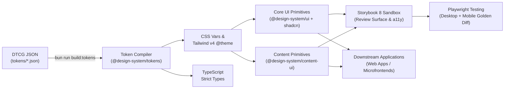

# Design System Architecture & Pipeline Build Guide

> **This document details the engineering architecture, core technical stack, multi-package decoupling strategy, component placement criteria, Storybook configuration standards, test harness explanations, and end-to-end automated pipelines.**  
> *For foundational color theory (OKLCH), W3C DTCG standards, WCAG/APCA contrast constraints, and AI asset strategy, consult [Design-System-Specifications.md](Design-System-Specifications.md). For CLI workflows, consult [Google-Design-CLI-Guide.md](Google-Design-CLI-Guide.md).*

---

## 1. Core Architecture: Code-as-Design & Unidirectional Pipeline

To prevent styling fragmentation and unconstrained code drift in AI-augmented development, the design system implements a **single authoritative, unidirectional build and validation pipeline**:



---

## 2. Technology Stack & Architectural Decisions

### 2.1 Technical Stack
- **Accessible Primitives**: **shadcn/ui** built atop Radix UI unstyled primitives, ensuring full keyboard navigation, screen reader support, and WCAG AA compliance.
- **Styling Engine**: **Tailwind CSS v4** native syntax. Design tokens are compiled and injected directly into the `@theme` directive via `@design-system/tokens`.
- **Type System**: **TypeScript 5+** in strict mode, exporting strong types for all components and variant props.
- **Package Manager & Orchestration**: **Bun Workspaces** combined with **Turborepo** for topological task execution and caching.
- **Font Policy**: Decoupled from runtime framework font loaders, exposing pure CSS variables (`--font-sans` and `--font-mono`).

### 2.2 Multi-Package Decoupling Strategy
1. **Runtime Isolation**: `@design-system/tokens` operates with zero runtime dependencies, allowing non-React landing pages and micro-frontends to consume tokens directly.
2. **Release Lifecycle Decoupling**: Core interactive primitives (`@design-system/ui`) maintain high semantic stability, while editorial layout components (`@design-system/content-ui`) iterate independently.
3. **Preventing Monolithic Clutter**: Avoids accumulating one-off business customizations inside the core primitive package.

---

## 3. Repository Directory Architecture

```text
├── tokens/                         # W3C DTCG Standard Design Tokens (JSON)
│   ├── foundation.tokens.json      # Base tokens: colors, 4px spacing scale, radius, fonts, motion
│   └── semantic.tokens.json        # Semantic aliases: surface elevation, text, border, action, status
├── packages/
│   ├── design-tokens/              # [Token Compiler] DTCG JSON -> CSS / Tailwind v4 / TS
│   │   ├── src/build.ts            # Recursive alias resolver, light/dark themes, @theme generator
│   │   └── dist/                   # Emitted artifacts: tokens.css, index.js, index.d.ts
│   ├── ui/                         # [Core UI Library] (@design-system/ui - 53 shadcn/ui Primitives)
│   │   ├── components.json         # shadcn/ui CLI configuration
│   │   ├── src/
│   │   │   ├── components/ui/      # 53 shadcn primitives (Button, Dialog, Sheet, Tabs, Chart...)
│   │   │   ├── components/         # ModeToggle (light/dark theme toggle dropdown)
│   │   │   ├── hooks/              # use-mobile.ts (responsive breakpoint detection)
│   │   │   ├── providers/          # theme.tsx (NextThemesProvider wrapper)
│   │   │   ├── lib/                # utils.ts (cn), fonts.ts (pure CSS variable font mapping)
│   │   │   └── index.ts            # Consolidated exports
│   │   └── dist/                   # Compiled ES modules and TypeScript definitions
│   └── content-ui/                 # [Editorial Content Library] (@design-system/content-ui)
│       └── src/                    # ArticleShell (max-w-[68ch]), Callout, Prose
├── apps/
│   ├── storybook/                  # [Visual Review & AI Sandbox] Storybook 8 + Vite 6
│   │   └── src/stories/            # 1-to-1 mapped stories for all 53 UI primitives + content
│   └── docs/                       # [Planned] Documentation portal
├── tests/
│   └── visual/                     # [Playwright Visual Regression Suite]
│       ├── __snapshots__/          # Desktop Chrome (1280x800) & Mobile Chrome (390x844) baselines
│       └── components.spec.ts      # Automated visual regression comparison specs
├── reference/                      # [Read-only External References] (Isolated by 3-step pipeline)
├── scripts/                        # Automation & Harness Utilities
│   └── serve-storybook.ts          # Local static Storybook server for Playwright visual runner
├── docs/                           # Architectural & Engineering Guides
│   ├── Design-System-Specifications.md # Complete specifications & science rationale
│   ├── Google-Design-CLI-Guide.md      # @google/design.md CLI integration & CI gates
│   ├── Design-System-Build-Guide.md    # Architecture & pipeline build guide
│   └── Design-System-Usage-Guide.md    # Downstream application consumption guide
├── DESIGN.md                       # Google Stitch plain-text design system (AI & CLI verified)
├── AGENTS.md                       # Binding AI agent UI contract and governance rules
├── turbo.json                      # Turborepo task pipeline configuration
└── package.json                    # Workspace root configuration (Bun workspaces)
```

---

## 4. Test Artifacts & Harness Architecture

### 4.1 Role and Governance of `test-results/`
- **Definition**: **Runtime Transient Artifacts**, not source code.
- **Generation**: Created automatically by Playwright when executing visual regression tests (`bun run test:visual`) whenever assertion differences or failures occur.
- **Contents**: Stores visual diff PNGs (highlighting pixel discrepancies in red), execution trace archives, and headless browser failure recordings.
- **Governance**:
  1. **Strictly Gitignored**: Listed in `.gitignore` and never committed to version control.
  2. **Diagnostic Utility**: Used by engineers during local debugging and CI failures to pinpoint unexpected pixel shifts.
  3. **Safe Cleanup**: Deleted automatically when running `bun run clean` without impacting project integrity.

### 4.2 Purpose of `scripts/serve-storybook.ts`
- **Definition**: **Test Infrastructure Harness Utility**.
- **Mechanism**: Playwright captures pixel-perfect snapshots by navigating headless Chromium instances to static Storybook story canvases (e.g., `http://localhost:6006/iframe.html?id=...`). Serving prebuilt static files (`apps/storybook/dist`) via Bun's native HTTP server avoids the overhead and reload latency of running a hot-reloading dev server during test execution.
- **Decoupling Benefits**:
  1. **Clean Production Bundles**: Isolates web server dependencies from core component packages (`@design-system/ui`, `@design-system/tokens`).
  2. **Seamless CI Automation**: Easily orchestrated in GitHub Actions via `bun run scripts/serve-storybook.ts` as a managed background process.

---

## 5. Standard Build & Development Workflow

### Step 1: Workspace Initialization
1. Configure root `package.json` workspaces:
   ```json
   {
     "packageManager": "bun@1.3.5",
     "workspaces": ["packages/*", "apps/*"]
   }
   ```
2. Configure `turbo.json` for topological task execution (`build:tokens`, `typecheck`, `build`).

### Step 2: DTCG Token Pipeline
1. Maintain W3C DTCG-compliant token files in `tokens/`.
2. Run `bun run build:tokens` to compile tokens into:
   - `tokens.css` with Tailwind v4 `@theme` directives
   - TypeScript definitions (`index.d.ts`)
   - Universal `@media (prefers-reduced-motion: reduce)` accessibility fallbacks.

### Step 3: Core Primitive Implementation (`@design-system/ui`)
1. Implement shadcn/ui components using Radix UI primitives.
2. Enforce relative internal imports (e.g., `../../lib/utils.js`) to prevent package alias breakage.
3. Export all 53 components and their TypeScript prop types through `packages/ui/src/index.ts`.

### Step 4: Editorial Content Package (`@design-system/content-ui`)
Provide dedicated typographic layout blocks for marketing articles and documentation:
- `ArticleShell`: Restricts optimal reading line width (`max-w-[68ch]`).
- `Callout`: Contextual advisory alerts.
- `Prose`: Vertical typographic cadence and prose styling.

### Step 5: Storybook 8 & Visual Regression Setup
1. **100% 1-to-1 Story Mapping**:
   - Provide an individual `[ComponentName].stories.tsx` in `apps/storybook/src/stories/` for every component.
   - Group stories under `ui/<ComponentName>` and `Content/<ComponentName>`.
   - Enable `tags: ["autodocs"]` to generate interactive controls.
2. **Tailwind CSS v4 Monorepo `@source` Directives**:
   Ensure Storybook styles detect class usage across sibling packages:
   ```css
   @import "tailwindcss";
   @import "@design-system/tokens/css";

   @source "../src/**/*.{ts,tsx}";
   @source "../../../packages/ui/src/**/*.{ts,tsx}";
   @source "../../../packages/ui/dist/**/*.{js,jsx}";
   @source "../../../packages/content-ui/src/**/*.{ts,tsx}";
   ```
3. **Dual-Viewport Visual Regression**:
   Capture baseline screenshots on both Desktop (1280x800) and Mobile (390x844) viewports: `bun run test:visual`.

---

## 6. Component Placement Criteria & Promotion Rules

### 6.1 Placement Principle: No Cross-App Demand, No Upstream Promotion
1. **Local Maintenance for App-Specific Views**:
   Visual containers, hero headers, or mockups used within a single application must remain in that application's codebase.
2. **Package Responsibilities**:
   - **`@design-system/ui`**: 53 standard shadcn/ui interactive primitives. Zero business logic, accessible by construction, driven by design tokens.
   - **`@design-system/content-ui`**: Cross-application editorial layout primitives.
3. **Promotion Requirements**:
   - [x] Verified reuse across at least 2 independent applications.
   - [x] Domain-neutral APIs without business state or routing dependencies.
   - [x] 1-to-1 Storybook story with 100% passing accessibility and visual regression tests.

### 6.2 Placement Decision Matrix

| Category | Example | Location | Rationale |
| :--- | :--- | :--- | :--- |
| **Standard Primitives** | `Button`, `Input`, `Dialog`, `Card`, `Badge` (53 total) | **`@design-system/ui`** | Zero business logic; universally reusable. |
| **Editorial Blocks** | `ArticleShell`, `Callout`, `Prose` | **`@design-system/content-ui`** | Long-form reading and content presentation. |
| **Site-Specific Visuals** | Hero cards, specific promotional banners | **Local Application Code** | Single-use visuals do not belong in a shared system. |
| **Application Shells** | Global navbars, user profile menus, footers | **Local Application Code** | Bound to user state and application routing. |

---

## 7. Command Reference

```bash
bun run build:tokens       # Compile DTCG JSON tokens to CSS / Tailwind v4 / TS
bun run lint:design        # Lint Google Stitch DESIGN.md & verify contrast compliance
bun run typecheck          # Run workspace-wide TypeScript type checking
bun run build              # Build all packages and applications via Turborepo
bun run storybook          # Launch local Storybook sandbox (port 6006)
bun run storybook:build    # Build static Storybook site
bun run test:visual        # Run Playwright dual-viewport visual regression tests
bun run test:visual:update # Update visual golden snapshots after approved design updates
```
