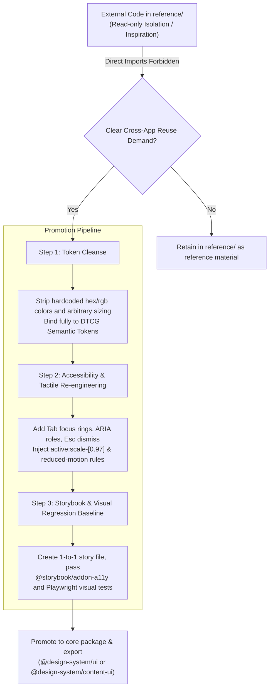
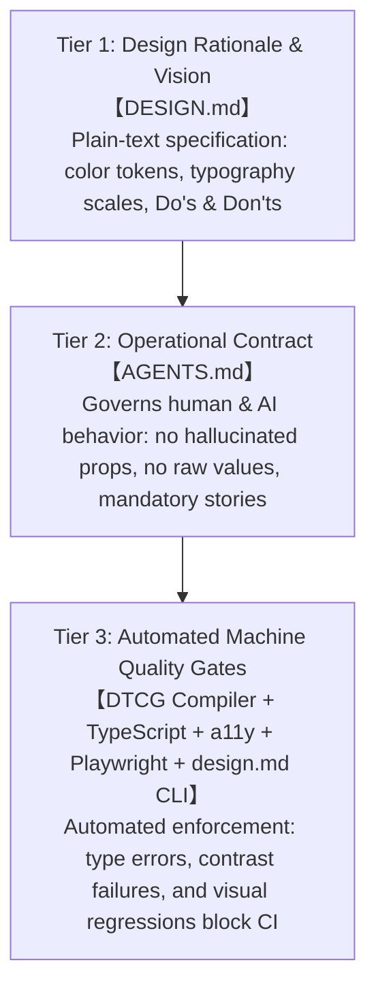

# Design System Specifications & Scientific Algorithms

> **This document establishes the authoritative specifications and scientific algorithms for the Design System Template. Written entirely in declarative statements, it defines the W3C DTCG standard, OKLCH wide-gamut color model, WCAG 2.1 AA and APCA contrast constraints, semantic token mapping, multi-tier surface elevation, micro-motion system, three-step promotion pipeline, design constraint pyramid, and the strategic value of `DESIGN.md` as an AI asset.**

---

## 1. W3C DTCG Standard Specification & Token Layering Architecture

The design system adopts the **W3C Design Tokens Community Group (DTCG)** format specification as the single authoritative source for design variables. The token architecture enforces strict decoupling between physical measurements and semantic intent:

```text
tokens/
├── foundation.tokens.json   # Foundation Tokens: Raw physical measurements
└── semantic.tokens.json     # Semantic Tokens: Contextual and functional mappings
```

### 1.1 Foundation Tokens
- **Role**: Declares absolute physical measurements, including neutral grayscale palettes, status color scales, 4px-grid spacing intervals, geometric border radii, font stacks, and micro-motion physical parameters.
- **Consumption Permissions**: Restricted exclusively to the token compiler (`packages/design-tokens`) and internal primitive style bindings. Downstream application code and business components are strictly prohibited from consuming foundation tokens directly.

### 1.2 Semantic Tokens
- **Role**: Establishes context-aware functional tokens (such as `surface.canvas`, `text.primary`, `border.default`, `action.primary`, `status.destructive`) via DTCG alias references (e.g., `{foundation.color.neutral.950}`).
- **Theme Encapsulation**: Governs color mappings and contextual inversions for both Light Mode and Dark Mode.
- **Consumption Permissions**: The sole authorized token layer for application pages, templates, and UI component variants.

---

## 2. OKLCH Wide-Gamut & Perceptually Uniform Color Architecture

The design system transitions foundational color modeling from legacy sRGB to the **OKLCH perceptual color space** (based on CIE Oklab).

### 2.1 Three-Dimensional Mathematical Definition of OKLCH
- **L (Lightness)**: Ranging from `0` (absolute black) to `1` (pure white). OKLCH delivers true **perceptual uniformity**, meaning colors with the same Lightness value stimulate identical brightness sensations on the human retina regardless of hue.
- **C (Chroma)**: Ranging from `0` to `0.4+`, objectively quantifying color purity and saturation beyond sRGB limits.
- **H (Hue Angle)**: Ranging from `0°` to `360°` (0°/360° for red, 80° for amber, 155° for emerald green, 260° for cool dark obsidian).

### 2.2 Engineering & Visual Advantages
1. **Unlocking Display P3 & Modern OLED Gamuts**: Conventional sRGB Hex strings compress dynamic color vibrancy. OKLCH renders purer, luminescent accent tones on Apple Liquid Retina and modern OLED displays without harsh glare, while eliminating murky gray banding in dark mode.
2. **Predictable Contrast Calculations**: The Lightness axis L is orthogonal to Chroma C and Hue H. Contrast compliance can be evaluated through predictable arithmetic deltas rather than non-linear perceptual adjustments.
3. **Native Tailwind CSS v4 Engine Synergy**: Tailwind CSS v4 treats CSS Color 4 standards as first-class citizens, compiling OKLCH values with native browser fallback.

### 2.3 Token Transformation Pipeline
```text
DTCG JSON Source (Foundation & Semantic)
  └──> build.ts (Recursive alias resolution & dependency topology)
        ├──> dist/tokens.css (--ds-semantic-color-*: ...)
        ├──> Tailwind v4 @theme (--color-*: var(...))
        └──> dist/index.d.ts (TypeScript strict types)
```

---

## 3. WCAG 2.1 AA & APCA Contrast Hard Constraints

Accessibility compliance constitutes a non-negotiable engineering baseline. The system enforces both statutory standards and next-generation perceptual algorithms.

### 3.1 Technical Specifications of Contrast Standards
1. **WCAG 2.1 AA (Statutory Baseline)**:
   - Calculation: Relative luminance ratio formula `(L1 + 0.05) / (L2 + 0.05)`.
   - **Normal Body Text (< 18pt / 24px, or < 14pt / 18.66px bold)**: Static contrast threshold must satisfy **≥ 4.5:1**.
   - **Large Text (≥ 18pt / 24px, or ≥ 14pt / 18.66px bold) and Graphical Objects**: Threshold must satisfy **≥ 3.0:1**.
2. **APCA (Accessible Perceptual Contrast Algorithm - WCAG 3.0 Candidate)**:
   - Calculation: Models human visual cortex response, factoring in polarity asymmetry (light text on dark vs. dark text on light), spatial frequency, and font weight to yield a perceptual lightness contrast value `Lc` (0 to 108+).
   - **Extended Reading Text**: Must satisfy `Lc ≥ 60 ~ 75`.
   - **Secondary & Caption Information**: Must satisfy `Lc ≥ 45`.

### 3.2 Foreground and Background Separation Rules
- **High-Contrast Ink Foundation**: `text.primary` in light mode utilizes deep neutral obsidian (`neutral-950`), achieving **> 15:1** contrast against pure white backgrounds (meeting WCAG AAA criteria).
- **Legible Secondary Copy**: `text.secondary` guarantees ≥ 4.5:1 contrast against light canvases, preventing low-contrast illegibility.
- **High-Contrast Interactive Triggers**: High-contrast buttons paired with white text utilize dark-calibrated backgrounds (`accent-dark` / `#15803d`) to maintain ≥ 4.5:1 contrast.

### 3.3 Automated Verification & Quality Gates
- **Static Token Linter**: The official `@google/design.md` CLI (`bun run lint:design`) computes contrast ratios across all component foreground/background combinations during PR and build phases.
- **Dynamic DOM Inspection**: Storybook integrates **`@storybook/addon-a11y`** (powered by **`axe-core`**), intercepting missing ARIA landmarks, broken contrast, and missing focus indicators in the rendered sandbox.
- **Visual Regression Testing**: Playwright runs automated snapshot diffing across Desktop (1280px) and Mobile (390px) viewports (`bun run test:visual`).

---

## 4. Semantic Token Mapping & Dark Mode Inversion

Semantic tokens translate raw palette scales into functional interface roles.

### 4.1 Namespace Taxonomy
- `surface.*`: Page canvases, containers, cards, and modal backdrops.
- `text.*`: Typographic hierarchy, captions, and accessible emphasis colors.
- `border.*`: Structural dividers, container boundaries, and subtle outlines.
- `action.*`: Default, hover, active, and disabled states for interactive controls.
- `status.*`: Semantic states for `destructive`, `warning`, `success`, and `info`.

### 4.2 Dual-Mode Mapping Matrix

| Semantic Token | Light Mode Mapping | Dark Mode Mapping | Functional Role |
| :--- | :--- | :--- | :--- |
| `surface.canvas` | `#ffffff` (Pure White) | `#09090b` (Obsidian) | Base viewport canvas |
| `surface.sunken` | `#fafafa` (Light Tint) | `#000000` (Inset Black) | Inset code blocks, search wells |
| `surface.subtle` | `#f4f4f5` (Soft Gray) | `#18181b` (Subtle Surface) | Sidebars, secondary panels |
| `surface.raised` | `#ffffff` + subtle shadow | `#27272a` (Elevated Card) | Primary feature cards, widgets |
| `surface.overlay`| `#ffffff` + modal shadow | `#3f3f46` (Overlay Tier) | Dialogs, popovers, dropdowns |
| `text.primary`   | `#09090b` (>18:1 contrast) | `#fafafa` (>18:1 contrast) | Headings, primary text |
| `text.secondary` | `#52525b` (>4.5:1 contrast) | `#a1a1aa` (>4.5:1 contrast) | Subtitles, supporting body text |
| `text.muted`     | `#a1a1aa` | `#71717a` | Placeholders, disabled text |
| `action.primary` | `#09090b` (Dark Button) | `#fafafa` (Light Button) | Primary viewport CTA |
| `status.destructive` | `#dc2626` | `#ef4444` | Error states, dangerous actions |

---

## 5. Multi-Tier Dark Elevation System (Elevation Tiers)

Depth in dark mode adheres to optical physics rather than diffuse drop shadows. Because black shadows lack contrast against dark canvases, diffuse shadows create visual muddiness.

### 5.1 Elevation Principle
> **In dark interfaces, visual hierarchy and three-dimensional depth are established through step-wise surface lightness combined with 1px translucent inner border highlights.**

### 5.2 Five-Tier Dark Elevation Matrix

| Tier | Semantic Token | Typical Application | Border & Highlight |
| :--- | :--- | :--- | :--- |
| **Level -1 (Sunken)** | `surface.sunken-dark` | Terminal wells, code blocks, sunken text inputs | `1px solid rgba(255, 255, 255, 0.06)` |
| **Level 0 (Canvas)** | `surface.canvas-dark` | Global page background viewport | None |
| **Level 1 (Subtle)** | `surface.subtle-dark` | Table striping, secondary sidebars, group wells | `1px solid rgba(255, 255, 255, 0.08)` |
| **Level 2 (Raised)** | `surface.raised-dark` | **Primary cards**, content containers, widget panels | `1px solid rgba(255, 255, 255, 0.12)` (`border-border`) |
| **Level 3 (Overlay)** | `surface.overlay-dark` | Modal dialogs, dropdown menus, floating popovers | `1px solid rgba(255, 255, 255, 0.16)` |

---

## 6. Micro-Motion System & Accessibility Fallback (Motion System)

### 6.1 Architectural Principle: CSS-First + State Machine Driven
The component library enforces a **"CSS-First + Tailwind v4 Token Mapping + Radix UI State Machine"** architecture, deliberately omitting heavy JS animation engines:
- **0 KB Runtime Overhead**: Core primitives (Button, Dialog, Tabs) animate directly via browser GPU hardware acceleration, adding zero weight to production bundles.
- **Zero Hydration Flicker**: Pure CSS micro-animations prevent SSR hydration mismatches in Next.js and Remix applications.
- **Marketing Animation Isolation**: Heavy scroll timelines, canvas particle meshes, and complex editorial keyframes are maintained in dedicated extension packages rather than bloating `@design-system/ui`.

### 6.2 Motion Token Scales
- **Duration Scale**:
  - `duration-instant: 100ms`: Micro-toggles, tactile click feedback.
  - `duration-fast: 150ms`: Button hover, tooltip reveal, focus ring expansion.
  - `duration-base: 200ms`: Accordion expand/collapse, dropdown reveal.
  - `duration-moderate: 300ms`: Modal scale-in, slide-out drawer transitions.
  - `duration-deliberate: 500ms`: Full-view transitions, multi-step route switches.
- **Easing Curves**:
  - `ease-default: cubic-bezier(0.16, 1, 0.3, 1)`: High-velocity exponential decelerate curve with crisp settling.
  - `ease-spring: cubic-bezier(0.175, 0.885, 0.32, 1.275)`: Light physical overshoot curve.
- **Tactile Scale Feedback**:
  - Interactive buttons and toggles enforce `active:scale-[0.97]`, delivering physical tactile confirmation upon press.

### 6.3 Global Accessibility Safeguard (prefers-reduced-motion)
The compiled `tokens.css` stylesheet injects a universal accessibility override:
```css
@media (prefers-reduced-motion: reduce) {
  *, *::before, *::after {
    animation-duration: 0.01ms !important;
    animation-iteration-count: 1 !important;
    transition-duration: 0.01ms !important;
    scroll-behavior: auto !important;
  }
}
```
When users enable reduced-motion in their operating system, all UI transitions collapse to instantaneous transitions, satisfying WCAG 2.1 Criteria 2.3.3.

---

## 7. Three-Step Promotion Pipeline for External Libraries

Components stored in `reference/` are subject to strict isolation rules and cannot be directly imported into application source code.

External libraries must pass through a standardized three-step promotion pipeline before integration:



1. **Step 1: Token Cleanse**:
   - Strip all raw hardcoded hex/rgb values, arbitrary box-shadows, and magic layout units, rebinding them to semantic design tokens (`var(--color-surface-raised)`, `rounded-pill`, etc.).
2. **Step 2: Accessibility & Tactile Re-engineering**:
   - Implement keyboard focus indicators, screen reader accessibility attributes, Escape-key dismissal, and `active:scale-[0.97]` tactile feedback.
3. **Step 3: Storybook & Visual Regression Baseline**:
   - Create a dedicated `[ComponentName].stories.tsx` in `apps/storybook/src/stories/`. The component must achieve 100% pass rates across `@storybook/addon-a11y` and Playwright visual regression tests before being exported.

---

## 8. Three-Tier Design Constraint Pyramid

The governance framework consists of a three-tier constraint pyramid delineating design rationale, operational rules, and automated quality gates:



1. **Tier 1: `DESIGN.md` (Design Rationale & Aesthetic Baseline)**:
   - Audience: Designers, architects, and AI Coding Agents.
   - Responsibility: Defines visual identity, palettes, typographic scales, elevation ladders, and explicit anti-patterns (Anti-Slop Doctrine).
2. **Tier 2: `AGENTS.md` (Operational Contract)**:
   - Audience: AI programming agents (Cursor, Claude Code, Antigravity, etc.) and human engineers.
   - Responsibility: Mandates strict behavioral boundaries—"Query Storybook first", "Never consume foundation tokens in apps", "Cover all component states in stories", "Follow three-step promotion pipeline".
3. **Tier 3: Automated Quality Gates (Machine Enforcement)**:
   - Tooling: `bun run build:tokens`, `bun run lint:design`, `turbo typecheck`, `@storybook/addon-a11y`, `playwright test`.
   - Responsibility: Prevents invalid code, contrast violations, and visual regressions from entering production by terminating PR pipelines upon failure.

---

## 9. Plain-Text Design System Specification & AI Asset Value

In modern automated software development, a machine-readable plain-text design specification (`DESIGN.md`) serves as a foundational engineering asset.

### 9.1 Solved Engineering Challenges
Traditional design systems residing in Figma files or heavy documentation portals are inaccessible to AI coding models in a lossless, token-efficient format. This limitation results in **design drift**, inconsistent spacing, and generic AI-generated interfaces.

### 9.2 Strategic Advantages of `DESIGN.md`
1. **Universal Context for AI Coding Agents**: By injecting `DESIGN.md` into AI agent system prompts, models understand exact color tokens, typography scales, elevation tiers, and constraints at minimal token consumption.
2. **Consistency Across Applications**: When creating new micro-frontends, internal tools, or client applications, AI agents reference `DESIGN.md` to produce accessible, on-brand interfaces out of the box.
3. **Codified Anti-Patterns**: The specification establishes Apple-grade negative constraints (single primary action, negative display tracking, no nested cards, no decorative gradients), eliminating generic AI design defaults.
4. **Automated CI Validation**: Paired with the `@google/design.md` CLI, the specification supports automated linting, WCAG contrast verification (`lint`), and semantic regression auditing (`diff`), enabling version-controlled design governance.
